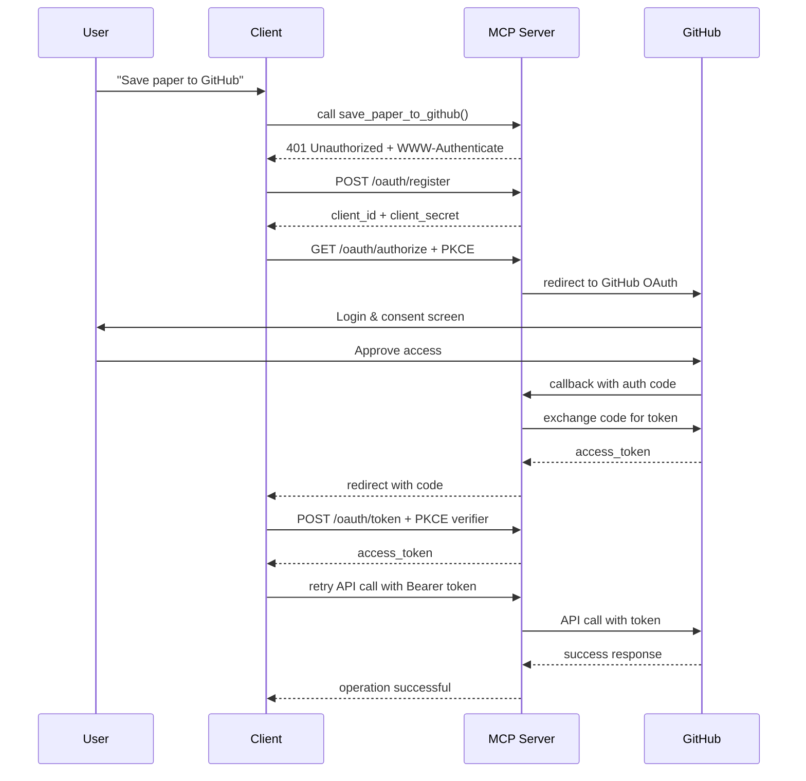

# OAuth 2.1 Research Assistant MCP Server

A complete demonstration of OAuth 2.1 + PKCE authentication with the Model Context Protocol (MCP), featuring GitHub API integration for saving research papers.

## 🎯 Overview

This server replaces the original Zotero integration with a proper OAuth 2.1 implementation that actually works with GitHub's API. It demonstrates:

- ✅ **OAuth 2.1 + PKCE** - Full implementation with security best practices
- ✅ **Dynamic Client Registration** - Automatic client setup per RFC 7591
- ✅ **GitHub Integration** - Save papers as repositories and gists
- ✅ **MCP OAuth Spec** - Complete MCP OAuth flow demonstration
- ✅ **Real API Integration** - Works with actual GitHub OAuth endpoints

## 🚀 Features

### OAuth 2.1 Implementation
- **Authorization Server Metadata** - RFC 8414 compliant discovery
- **PKCE Security** - Code challenge/verifier flow for security
- **Dynamic Registration** - Automatic client credential generation
- **Token Management** - Access token lifecycle management

### GitHub Integration
- **Repository Creation** - Save papers as GitHub repositories
- **Gist Creation** - Create research notes as private gists
- **Metadata Generation** - Automatic README and citation generation
- **Research Templates** - Pre-built note-taking templates

### MCP Capabilities
- **Protected Tools** - OAuth-gated API operations
- **Progress Notifications** - Real-time operation feedback
- **Resource Access** - Paper metadata and abstracts
- **Error Handling** - Graceful OAuth error management

## 📋 Prerequisites

1. **GitHub OAuth App** - Create at https://github.com/settings/applications/new
   - Authorization callback URL: `http://localhost:8002/oauth/callback`
   - Note your Client ID and Client Secret

2. **Python Environment**
   ```bash
   python -m venv venv
   source venv/bin/activate  # On Windows: venv\Scripts\activate
   pip install -e .
   ```

## ⚙️ Configuration

1. **Update OAuth Credentials** in `oauth_server.py`:
   ```python
   GITHUB_CLIENT_ID = "your_github_client_id"
   GITHUB_CLIENT_SECRET = "your_github_client_secret"
   ```

2. **Environment Variables** (recommended):
   ```bash
   export GITHUB_CLIENT_ID="your_client_id"
   export GITHUB_CLIENT_SECRET="your_client_secret"
   ```

## 🏃‍♂️ Usage

### 1. Start the OAuth MCP Server

```bash
python oauth_server.py
```

The server will start on `http://localhost:8002` with OAuth endpoints:
- `/.well-known/oauth-authorization-server` - Discovery metadata
- `/oauth/register` - Dynamic client registration
- `/oauth/authorize` - Authorization endpoint
- `/oauth/token` - Token exchange endpoint

### 2. Run the Demo Client

```bash
python oauth_client_demo.py
```

This will:
1. **Register** a new OAuth client dynamically
2. **Authorize** with GitHub via browser redirect
3. **Connect** to the MCP server with Bearer token
4. **Search** for research papers on ArXiv
5. **Save** papers to GitHub repositories
6. **Create** research gists with notes

### 3. Manual Testing

Test OAuth endpoints directly:

```bash
# Get authorization server metadata
curl http://localhost:8002/.well-known/oauth-authorization-server

# Register a new client
curl -X POST http://localhost:8002/oauth/register \
  -H "Content-Type: application/json" \
  -d '{"redirect_uris": ["http://localhost:3000/callback"], "scope": "repo"}'
```

## 🔐 OAuth Flow Sequence



## 🛠️ Available Tools

### `search_papers(query, max_results)`
Search ArXiv for research papers (no auth required).

### `save_paper_to_github(paper_id, repo_name)` 🔒
Create a GitHub repository with paper information (requires `repo` scope).

### `create_research_gist(paper_id, notes)` 🔒
Create a private gist with paper summary and research notes (requires `gist` scope).

## 📁 Generated Content

### Repository Structure
```
research-paper-repo/
├── README.md              # Comprehensive paper information
├── paper_metadata.json    # Machine-readable metadata
├── research_notes.md      # Research notes template
└── .gitignore            # Python gitignore
```

### Gist Content
- **Paper summary** with metadata
- **Research notes** section
- **Citation format** (BibTeX)
- **Related links** (ArXiv, PDF)

## 🔍 Testing

Run the test suite:

```bash
pytest
```

Test specific components:

```bash
# Test OAuth endpoints
pytest tests/test_oauth.py

# Test GitHub integration
pytest tests/test_github.py

# Test MCP tools
pytest tests/test_tools.py
```

## 🐛 Troubleshooting

### Common Issues

1. **OAuth Redirect Mismatch**
   - Ensure GitHub app callback URL matches `REDIRECT_URI`
   - Check for trailing slashes in URLs

2. **Token Exchange Fails**
   - Verify GitHub client credentials are correct
   - Check network connectivity to GitHub API

3. **MCP Connection Issues**
   - Ensure server is running on correct port (8002)
   - Verify Bearer token is included in requests

### Debug Mode

Enable debug logging:

```python
import logging
logging.basicConfig(level=logging.DEBUG)
```

## 🌟 Key Improvements Over Original

| Aspect | Original (Zotero) | New (GitHub OAuth) |
|--------|------------------|-------------------|
| **OAuth Support** | ❌ No OAuth | ✅ Full OAuth 2.1 + PKCE |
| **API Compatibility** | ❌ Limited | ✅ Works with real APIs |
| **Security** | ❌ API keys only | ✅ Proper OAuth scopes |
| **Demo Viability** | ❌ Aspirational | ✅ Actually functional |
| **MCP Compliance** | ❌ Partial | ✅ Complete implementation |

## 📚 References

- [OAuth 2.1 Specification](https://datatracker.ietf.org/doc/html/draft-ietf-oauth-v2-1)
- [RFC 7636 - PKCE](https://tools.ietf.org/html/rfc7636)
- [RFC 7591 - Dynamic Client Registration](https://tools.ietf.org/html/rfc7591)
- [MCP OAuth Specification](https://modelcontextprotocol.io/docs/oauth)
- [GitHub OAuth Documentation](https://docs.github.com/en/developers/apps/building-oauth-apps)

## 🤝 Contributing

1. Fork the repository
2. Create a feature branch
3. Add tests for new functionality
4. Ensure all tests pass
5. Submit a pull request

---

**This implementation provides a real, working demonstration of OAuth 2.1 with MCP, showcasing the actual capabilities rather than aspirational features.**
