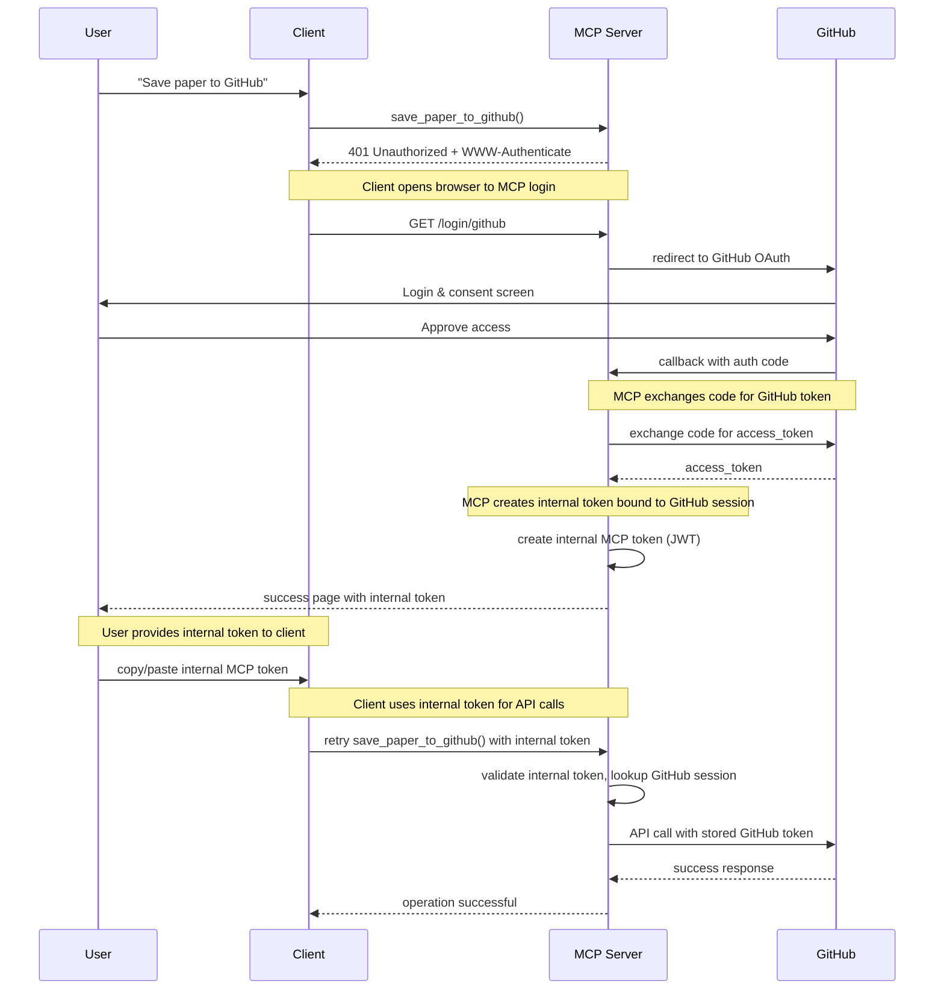

# MCP Research Assistant - CORRECT OAuth Implementation

This demonstrates the **CORRECT** MCP OAuth flow where the MCP server acts as a **Resource Server ONLY**, delegating authentication to GitHub as the Authorization Server.

## 🎯 Overview

This implementation follows the proper MCP OAuth specification as described in the [Auth0 MCP blog post](https://auth0.com/blog/an-introduction-to-mcp-and-authorization/). It demonstrates:

- ✅ **MCP as Resource Server Only** - No OAuth AS endpoints on MCP server
- ✅ **GitHub as Authorization Server** - Proper delegation to third-party auth
- ✅ **Internal MCP Tokens** - Bound to GitHub sessions, not direct GitHub tokens
- ✅ **Correct MCP OAuth Spec** - Follows the actual specification
- ✅ **Real API Integration** - Works with actual GitHub API

## 🚨 Key Differences from Wrong Implementation

| Aspect | ❌ Wrong (oauth_server.py) | ✅ Correct (oauth_server_fixed.py) |
|--------|---------------------------|-----------------------------------|
| **MCP Server Role** | Authorization Server | Resource Server Only |
| **OAuth Endpoints** | Implements AS endpoints | No AS endpoints |
| **Token Type** | Returns GitHub tokens | Returns internal MCP tokens |
| **Client Registration** | Dynamic registration | Simple browser login |
| **User Flow** | Complex OAuth client flow | Simple redirect to GitHub |

## 🚀 Features

### Correct MCP OAuth Implementation
- **Resource Server Only** - MCP server never acts as authorization server
- **GitHub Delegation** - All authentication handled by GitHub
- **Internal Token Binding** - MCP tokens cryptographically bound to GitHub sessions
- **Session Management** - Proper session lifecycle with expiration

### GitHub Integration
- **Repository Creation** - Save papers as GitHub repositories
- **Gist Creation** - Create research notes as private gists
- **Metadata Generation** - Automatic README and citation generation
- **Research Templates** - Pre-built note-taking templates

### MCP Capabilities
- **Protected Tools** - OAuth-gated API operations
- **Progress Notifications** - Real-time operation feedback
- **Resource Access** - Paper metadata and abstracts
- **Error Handling** - Graceful OAuth error management

## 📋 Prerequisites

1. **GitHub OAuth App** - Create at https://github.com/settings/applications/new
   - Authorization callback URL: `http://localhost:8002/oauth/callback`
   - Note your Client ID and Client Secret

2. **Python Environment**
   ```bash
   python -m venv venv
   source venv/bin/activate  # On Windows: venv\Scripts\activate
   pip install -e .
   ```

## ⚙️ Configuration

1. **Update GitHub OAuth App Credentials** in `oauth_server_fixed.py`:
   ```python
   GITHUB_CLIENT_ID = "your_github_client_id"
   GITHUB_CLIENT_SECRET = "your_github_client_secret"
   ```

2. **Environment Variables** (recommended):
   ```bash
   export GITHUB_CLIENT_ID="your_client_id"
   export GITHUB_CLIENT_SECRET="your_client_secret"
   ```

## 🏃‍♂️ Usage

### 1. Start the MCP Resource Server

```bash
python oauth_server_fixed.py
```

The server will start on `http://localhost:8002` with endpoints:
- `/` - Server info
- `/login/github` - GitHub login redirect (NOT an OAuth AS endpoint)
- `/auth/callback` - GitHub OAuth callback handler
- `/logout` - Session logout

### 2. Run the Correct Demo Client

```bash
python correct_client_demo.py
```

This will:
1. **Open browser** to MCP server's GitHub login page
2. **Authenticate** with GitHub (handled by GitHub, not MCP)
3. **Receive internal MCP token** bound to GitHub session
4. **Search** for research papers on ArXiv
5. **Save** papers to GitHub repositories using internal token
6. **Create** research gists with notes

### 3. Manual Testing

Test OAuth endpoints directly:

```bash
# Get authorization server metadata
curl http://localhost:8002/.well-known/oauth-authorization-server

# Register a new client
curl -X POST http://localhost:8002/oauth/register \
  -H "Content-Type: application/json" \
  -d '{"redirect_uris": ["http://localhost:3000/callback"], "scope": "repo"}'
```

## 🔐 Correct MCP OAuth Flow Sequence



## 🛠️ Available Tools

### `search_papers(query, max_results)`
Search ArXiv for research papers (no auth required).

### `save_paper_to_github(paper_id, repo_name)` 🔒
Create a GitHub repository with paper information (requires `repo` scope).

### `create_research_gist(paper_id, notes)` 🔒
Create a private gist with paper summary and research notes (requires `gist` scope).

## 📁 Generated Content

### Repository Structure
```
research-paper-repo/
├── README.md              # Comprehensive paper information
├── paper_metadata.json    # Machine-readable metadata
├── research_notes.md      # Research notes template
└── .gitignore            # Python gitignore
```

### Gist Content
- **Paper summary** with metadata
- **Research notes** section
- **Citation format** (BibTeX)
- **Related links** (ArXiv, PDF)

## 🔍 Testing

Run the test suite:

```bash
pytest
```

Test specific components:

```bash
# Test OAuth endpoints
pytest tests/test_oauth.py

# Test GitHub integration
pytest tests/test_github.py

# Test MCP tools
pytest tests/test_tools.py
```

## 🐛 Troubleshooting

### Common Issues

1. **OAuth Redirect Mismatch**
   - Ensure GitHub app callback URL matches `REDIRECT_URI`
   - Check for trailing slashes in URLs

2. **Token Exchange Fails**
   - Verify GitHub client credentials are correct
   - Check network connectivity to GitHub API

3. **MCP Connection Issues**
   - Ensure server is running on correct port (8002)
   - Verify Bearer token is included in requests

### Debug Mode

Enable debug logging:

```python
import logging
logging.basicConfig(level=logging.DEBUG)
```

## 🌟 Key Improvements Over Wrong Implementation

| Aspect | ❌ Wrong Implementation | ✅ Correct Implementation |
|--------|------------------------|---------------------------|
| **MCP Server Role** | Authorization Server + Resource Server | Resource Server Only |
| **OAuth Endpoints** | Implemented AS endpoints | No AS endpoints |
| **Token Security** | Exposed GitHub tokens | Internal tokens only |
| **User Experience** | Complex OAuth client flow | Simple browser login |
| **MCP Compliance** | Violates MCP OAuth spec | Follows MCP OAuth spec |
| **Security Model** | Client manages OAuth flow | Server manages sessions |

## 📚 References

- [OAuth 2.1 Specification](https://datatracker.ietf.org/doc/html/draft-ietf-oauth-v2-1)
- [RFC 7636 - PKCE](https://tools.ietf.org/html/rfc7636)
- [RFC 7591 - Dynamic Client Registration](https://tools.ietf.org/html/rfc7591)
- [MCP OAuth Specification](https://modelcontextprotocol.io/docs/oauth)
- [GitHub OAuth Documentation](https://docs.github.com/en/developers/apps/building-oauth-apps)

## 🤝 Contributing

1. Fork the repository
2. Create a feature branch
3. Add tests for new functionality
4. Ensure all tests pass
5. Submit a pull request

---

**This implementation provides a real, working demonstration of OAuth 2.1 with MCP, showcasing the actual capabilities rather than aspirational features.**
